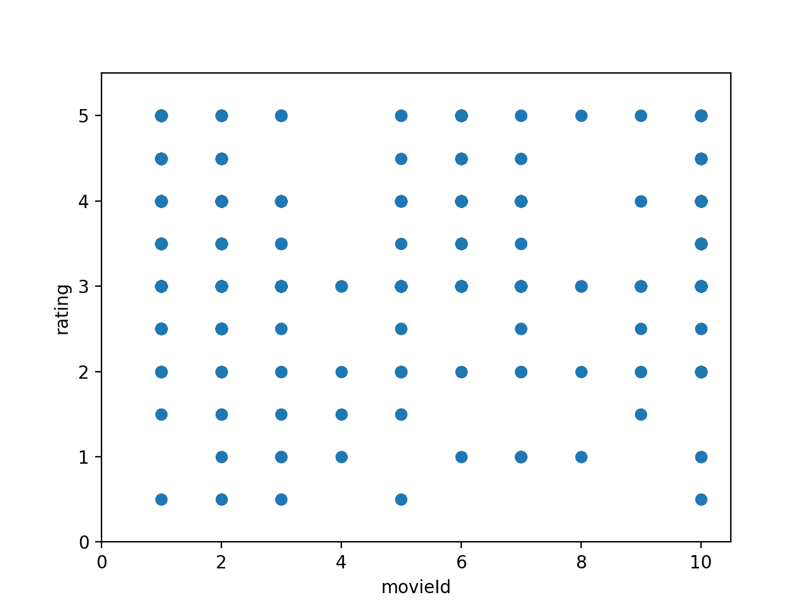
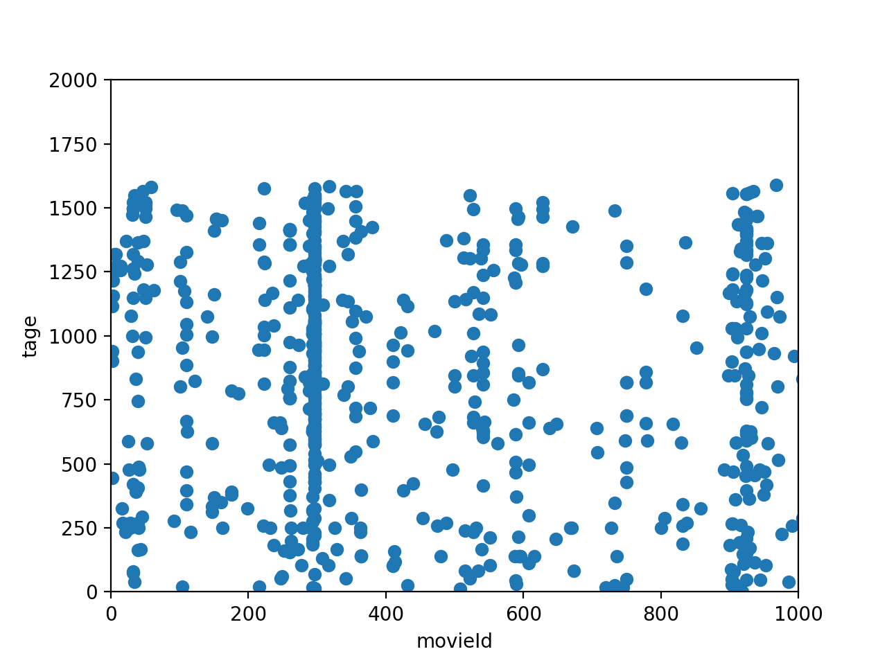
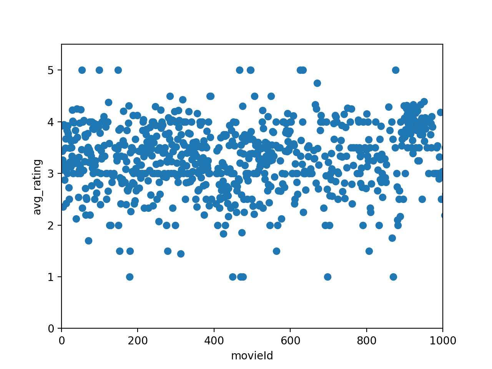
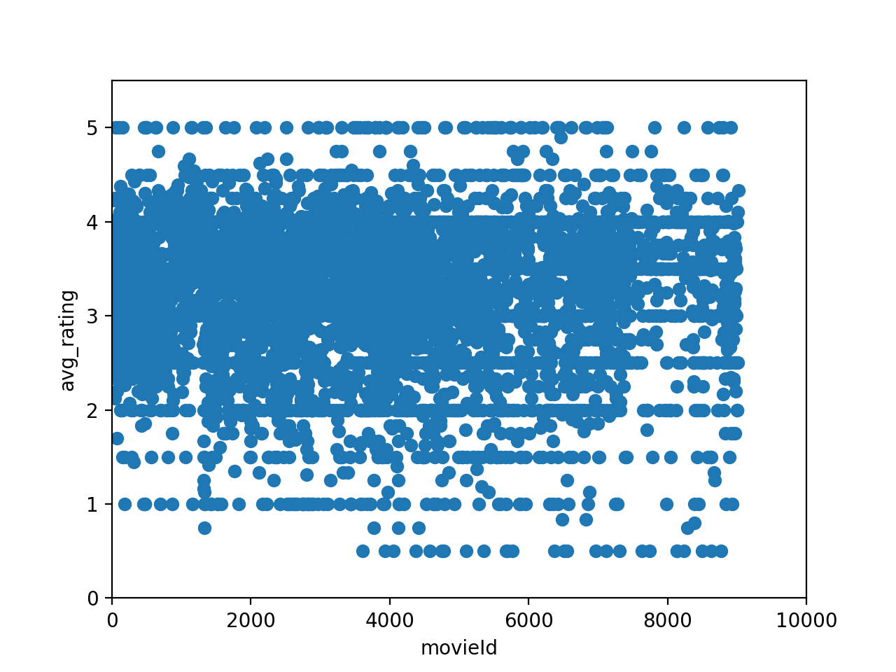

#EECS731_Project02

Blockbuster or art film?
1. Set up a data science project structure in a new git repository in your GitHub account
2. Download the one of the MovieLens datasets from https://grouplens.org/datasets/movielens/
3. Load the data set into panda data frames
4. Formulate one or two ideas on how the combination of ratings and tags by users helps the data set to establish additional value using exploratory data analysis
5. Build one or more clustering models to determine similar movies to recommend using the other ratings and tags of movies by other users as features
6. Document your process and results
7. Commit your notebook, source code, visualizations and other supporting files to the git repository in GitHub

#The combination of ratings and tags by users
From the two data sets, they have three common attributes, namely userId, movieId, and timestamp.
We can combine overlapping items in the two data sets to obtain new expressions.
Then we can predict their semantics by counting the frequency of appearance of different tags. This abstract semantics is of greater help to the entire data set.
We will also average the ratings of movies, which makes our data more objective.
For movie recommendation, we can predict the best recommended movie and users through the combination of the abstract semantics of the label and the average rating.

#Clustering models
I pick k-mean as the Clustering model.
We use two k-means to process the label data set and the average rating data set respectively.

average ratings:

more data:

Then, we select the appropriate and relevant movie by matching the two prediction results.

We will pick the prediction results where are equal to each other as the recommendation, since the result obtained in this way meets the expectations of the two data sets.

#Results
True: recommend
False: not recommend

[(1, False), (2, False), (3, False), (4, False), (5, False), (6, True), (7, False), (8, False), (9, False), (10, False), (11, False), (12, False), (13, False), (14, False), (15, False), (16, False), (17, False), (18, False), (19, False), (20, False), (21, False), (22, False), (23, False), (24, False), (25, False), (26, False), (27, False), (28, True), (29, False), (30, True), (31, True), (32, False), (34, False), (36, False), (38, False), (39, False), (40, False), (41, False), (42, False), (43, False), (44, False), (45, True), (46, False), (47, False), (48, False), (65585, False), (50, False), (52, False), (53, False), (54, False), (55, False), (57, False), (58, False), (60, False), (61, True), (62, False), (63, False), (64, True), (65, False), (66, False), (68, False), (69, False), (70, False), (71, False), (72, False), (73, False), (74, False), (75, True), (76, False), (77, False), (78, False), (79, False), (80, True), (81, True), (82, False), (83, False), (85, False), (86, False), (87, False), (88, False), (89, False), (92, False), (93, False), (94, False), (95, True), (96, False), (97, False), (99, False), (100, False), (101, False), (102, False), (103, False), (104, False), (105, True), (106, False), (107, False), (108, False), (110, False), (111, True), (112, False), (113, False), (65651, False), (116, False), (117, False), (118, False), (119, False), (121, False), (122, False), (123, False), (32892, False), (125, False), (126, False), (128, False), (129, False), (32898, False), (5483, False), (132, True), (135, True), (137, False), (32906, False), (140, False), (141, False), (144, False), (145, False), (146, True), (147, False), (148, False), (32917, False), (150, False), (151, False), (152, False), (153, False), (154, False), (155, False), (156, False), (157, False), (158, False), (159, True), (160, False), (161, True), (162, True), (163, False), (164, False), (165, False), (166, False), (168, False), (169, False), (170, False), (171, True), (172, False), (173, False), (174, False), (175, False), (176, False), (177, False), (178, False), (179, False), (180, False), (181, False), (183, False), (184, False), (185, False), (186, True), (187, False), (188, False), (189, False), (190, False), (191, False), (193, False), (194, False), (195, False), (196, False), (198, False), (199, False), (201, False), (65738, False), (203, False), (204, False), (205, False), (206, False), (207, False), (208, False), (209, False), (210, False), (211, False), (212, False), (213, True), (214, False), (215, False), (216, False), (217, False), (218, False), (219, False), (220, False), (222, False), (223, False), (224, False), (225, True), (227, False), (228, False), (229, False), (230, False), (231, True), (232, False), (233, False), (234, False), (235, False), (236, False), (237, False), (238, False), (239, False), (240, False), (241, False), (242, False), (243, False), (246, False), (247, True), (248, False), (249, False), (250, False), (251, False), (252, False), (253, False), (254, False), (255, False), (256, False), (257, False), (258, False), (259, True), (260, False), (261, False), (262, False), (263, False), (265, False), (266, False), (267, False), (5506, False), (270, False), (271, False), (272, False), (273, False), (274, False), (275, False), (276, False), (277, False), (278, True), (279, False), (280, False), (98585, False), (282, False), (283, False), (284, True), (285, False), (287, False), (288, False), (289, False), (290, False), (291, False), (292, False), (293, True), (294, False), (295, False), (296, False), (298, True), (299, False), (300, False), (301, False), (302, False), (303, False), (304, False), (305, False), (306, False), (307, False), (308, False), (310, False), (311, False), (312, False), (313, False), (314, False), (315, False), (316, False), (317, False), (318, True), (319, False), (320, False), (321, False), (322, False), (5515, False), (324, False), (325, False), (326, False), (327, False), (328, False), (329, False), (330, False), (331, False), (332, False), (333, False), (334, False), (335, False), (336, False), (337, False), (338, False), (339, False), (340, False), (341, False), (342, False), (343, False), (344, False), (345, False), (346, False), (347, False), (348, True), (349, True), (350, False), (351, False), (352, False), (353, False), (354, False), (355, False), (356, False), (357, False), (358, False), (359, False), (360, False), (361, False), (362, False), (363, False), (364, False), (365, True), (366, False), (367, False), (368, False), (369, False), (370, False), (371, False), (372, False), (373, False), (374, True), (376, False), (33145, False), (378, False), (379, False), (380, False), (381, False), (382, False), (383, False), (384, False), (385, False), (33154, False), (387, False), (388, False), (38294, False), (390, False), (391, True), (393, False), (33162, False), (33164, False), (33166, False), (27373, False), (33171, False), (405, False), (406, False), (407, False), (408, False), (409, False), (410, False), (412, False), (413, False), (414, False), (415, False), (416, False), (417, False), (418, False), (419, False), (420, False), (421, True), (422, False), (423, False), (424, False), (425, True), (426, False), (427, False), (428, False), (429, False), (430, False), (431, False), (432, False), (433, False), (434, False), (435, False), (436, False), (437, True), (438, False), (440, False), (441, False), (442, False), (444, False), (445, False), (65982, False), (448, False), (449, False), (450, False), (451, False), (452, False), (453, True), (454, False), (455, False), (456, False), (457, False), (458, False), (459, False), (460, False), (461, False), (464, False), (466, False), (467, False), (468, False), (469, False), (470, False), (471, False), (472, False), (473, False), (474, False), (475, True), (476, False), (477, True), (478, False), (479, False), (480, False), (481, False), (482, True), (484, False), (485, False), (486, False), (487, False), (488, False), (489, False), (490, False), (491, True), (492, False), (493, False), (494, False), (98799, False), (496, False), (497, False), (499, False), (500, False), (501, False), (502, False), (504, True), (505, False), (131578, False), (507, False), (508, False), (509, False), (510, False), (511, False), (512, False), (513, False), (514, False), (515, False), (516, True), (517, False), (518, False), (519, False), (520, False), (521, False), (522, False), (523, False), (524, False), (33294, False), (527, False), (528, False), (529, False), (531, True), (532, False), (533, False), (534, False), (535, False), (536, False), (537, False), (538, False), (539, True), (540, False), (541, True), (542, True), (543, False), (544, False), (546, False), (547, False), (548, False), (549, True), (550, False), (551, False), (552, False), (553, False), (66090, False), (555, False), (556, True), (558, False), (66097, False), (562, False), (563, False), (564, False), (32862, False), (567, False), (568, False), (569, False), (65631, False), (92938, False), (574, False), (575, False), (577, False), (579, False), (580, False), (581, False), (583, False), (131656, False), (585, False), (586, True), (587, False), (588, False), (589, False), (590, False), (592, True), (593, False), (594, False), (595, False), (596, False), (597, False), (599, False), (600, False), (602, False), (98908, False), (605, False), (606, False), (608, False), (609, False), (610, False), (611, False), (612, False), (613, False), (615, False), (616, False), (617, True), (618, False), (619, False), (626, False), (627, False), (628, False), (631, False), (632, False), (633, False), (634, False), (635, False), (636, False), (637, False), (638, False), (639, False), (640, False), (131714, False), (32875, False), (645, True), (647, False), (648, False), (649, False), (650, True), (131724, True), (653, True), (656, False), (98961, False), (661, False), (662, False), (663, False), (665, False), (667, False), (668, False), (33437, False), (670, False), (671, True), (673, True), (674, False), (131749, False), (678, False), (679, False), (680, False), (685, False), (688, False), (691, False), (692, False), (694, False), (695, False), (697, False), (698, True), (700, False), (99005, False), (99007, False), (704, False), (706, False), (707, True), (708, False), (709, False), (710, False), (711, False), (714, False), (715, False), (718, False), (719, False), (720, False), (722, False), (724, False), (33493, False), (726, False), (33495, False), (728, False), (33499, False), (733, False), (735, False), (736, False), (737, False), (741, True), (742, False), (743, False), (745, False), (747, True), (748, False), (750, False), (131826, False), (757, False), (759, False), (760, False), (66297, False), (762, False), (764, False), (765, False), (766, False), (773, False), (66310, False), (775, False), (778, False), (779, False), (780, False), (781, False), (782, False), (783, False), (784, False), (785, False), (786, False), (788, True), (33558, False), (791, False), (795, False), (33564, False), (798, False), (799, False), (800, False), (801, False), (802, False), (803, False), (804, False), (805, False), (806, False), (164647, False), (808, False), (809, False), (99114, False), (99117, False), (164655, True), (818, False), (823, False), (824, False), (99130, False), (828, True), (829, False), (830, False), (832, False), (833, False), (835, False), (836, False), (837, False), (838, False), (839, False), (840, False), (99145, False), (842, False), (99149, False), (33615, False), (848, False), (849, False), (851, False), (852, False), (858, False), (861, False), (131934, False), (866, False), (867, False), (869, False), (870, False), (33639, True), (109372, False), (875, False), (33644, False), (65682, False), (33646, True), (879, False), (880, False), (881, False), (882, False), (885, False), (886, False), (99191, False), (888, False), (889, False), (891, False), (892, False), (893, False), (65685, False), (896, False), (897, False), (898, False), (899, False), (900, False), (901, False), (902, False), (903, False), (904, False), (905, False), (906, True), (907, False), (908, False), (909, False), (910, False), (33679, False), (912, False), (913, False), (914, False), (915, False), (916, False), (917, False), (918, False), (919, False), (920, False), (921, False), (922, False), (923, False), (924, False), (926, True), (927, False), (928, False), (929, False), (930, True), (931, False), (932, False), (933, False), (934, False), (935, False), (936, False), (937, False), (938, False), (940, True), (941, False), (942, False), (943, False), (944, False), (945, False), (946, False), (947, False), (948, True), (949, False), (950, False), (951, False), (952, False), (953, False), (954, False), (955, False), (956, False), (33725, False), (959, False), (961, False), (963, False), (965, False), (968, False), (969, False), (970, True), (971, False), (66509, False), (132046, False), (66511, True), (976, False), (979, False), (981, False), (982, False), (984, True), (986, False), (987, False), (988, False), (990, False), (131237, False), (993, False), (994, False), (996, False), (998, False), (999, False), (1003, False), (1004, False), (1005, False), (1006, False), (1007, False), (1008, False), (1009, False), (1010, False), (1011, False), (1012, False), (1013, False), (1014, False), (1015, False), (1016, True), (1017, False), (1018, False), (1019, False), (1020, False), (1021, False), (1022, False), (1023, False), (1024, False), (1025, False), (33794, False), (1027, False), (1028, False), (1029, False), (1030, False), (1031, False), (1032, True), (1033, False), (1034, False), (1035, False), (1036, False), (1037, False), (1040, True), (164881, False), (1042, False), (1043, False), (1046, False), (1047, False), (1049, False), (1050, False), (1051, False), (1053, False), (1054, False), (1055, False), (1056, False), (1057, False), (33826, False), (1059, False), (1060, False), (1061, False), (33830, False), (1064, False), (1066, False), (33836, False), (164909, False), (33838, False), (1073, False), (1077, False), (1078, False), (1079, False), (1080, False), (1081, True), (1082, False), (1083, False), (1084, False), (132157, False), (1086, False), (1088, False), (1089, False), (1090, False), (1091, False), (1092, False), (1093, False), (1094, False), (1095, False), (1096, False), (1097, False), (1099, False), (1100, False), (1101, False), (1103, False), (1104, False), (1105, False), (1107, False), (1111, False), (33880, False), (1114, False), (1116, True), (1117, False), (1119, False), (1120, False), (1121, False), (98491, False), (1124, True), (1125, True), (1126, False), (1127, False), (33896, False), (1129, False), (1130, False), (1131, False), (1132, True), (99437, False), (1135, False), (1136, False), (1137, False), (1140, False), (1144, False), (1147, True), (1148, True), (1150, False), (1151, False), (1156, False), (1161, False), (1162, False), (1163, False), (1167, False), (1170, False), (1171, False), (1172, False), (1173, False), (1175, False), (1176, False), (1177, False), (1178, False), (1179, False), (1180, False), (1183, False), (1184, False), (1185, False), (1186, False), (1187, False), (1188, False), (1189, False), (1190, False), (1191, False), (1192, False), (1193, False), (1194, False), (98503, True), (1196, False), (1197, False), (1198, False), (1199, False), (1200, False), (1201, False), (1202, False), (1203, False), (1204, False), (1206, False), (1207, False), (1208, False), (1209, True), (1210, False), (1211, False), (1212, True), (1213, False), (1214, False), (1215, False), (1216, False), (1217, False), (1218, True), (1219, False), (1220, False), (1221, False), (1222, False), (1223, True), (1224, False), (1225, True), (1226, False), (1227, False), (1228, False), (1230, False), (1231, False), (1232, False), (1233, False), (1234, False), (1235, False), (1236, False), (1237, False), (1238, False), (1240, False), (1241, False), (1242, False), (1243, False), (1244, False), (1245, False), (1246, False), (1247, True), (1248, False), (1249, False), (1250, False), (1251, False), (1252, False), (1253, False), (1254, False), (1255, False), (1256, False), (1257, False), (1258, False), (1259, False), (1260, True), (1261, False), (1262, True), (1263, False), (1264, False), (1265, False), (1266, False), (1267, False), (1268, False), (1269, False), (1270, False), (1271, False), (1272, False), (1273, False), (1274, False), (1275, False), (1276, False), (1277, False), (1278, True), (1279, False), (34048, False), (1281, False), (1282, False), (1283, False), (1284, True), (1285, False), (1286, False), (1287, False), (1288, False), (1289, True), (1290, False), (1291, False), (1292, False), (1293, False), (1295, False), (1296, False), (1297, False), (1298, False), (1299, True), (1300, False), (1301, False), (1302, False), (1303, False), (1304, False), (1305, False), (1306, False), (1307, False), (1310, False), (1312, False), (103984, False), (1318, False), (1320, False), (1321, False), (1322, False), (1323, False), (1324, False), (1325, False), (1326, False), (1327, False), (1328, False), (1329, True), (1330, False), (1331, False), (99636, False), (1333, False), (1334, False), (1335, False), (1336, False), (1337, False), (1339, False), (1340, False), (1341, False), (1342, False), (1343, False), (1344, False), (1345, False), (1346, False), (1347, False), (1348, False), (1349, False), (132422, False), (1351, False), (132424, False), (1353, False), (1354, True), (1355, False), (1356, False), (1357, False), (1358, False), (1359, False), (1361, False), (1363, False), (1365, True), (1366, False), (1367, False), (1370, False), (1371, False), (1372, False), (1373, False), (1374, False), (1375, True), (1376, False), (1377, False), (1378, False), (1379, True), (1380, False), (1381, False), (34150, False), (34153, False), (1387, False), (1388, False), (1389, True), (1390, False), (1391, False), (1392, False), (1393, False), (1394, False), (1395, False), (1396, False), (1397, False), (66934, False), (1399, False), (1401, False), (1405, False), (1406, True), (1407, False), (1408, True), (1409, False), (1411, False), (1412, False), (1413, False), (1414, False), (1415, False), (1416, False), (1417, False), (1419, False), (1422, False), (114925, False), (99728, False), (1425, False), (1426, False), (1427, False), (1428, False), (1429, False), (1430, False), (1431, False), (1432, False), (1437, False), (1438, False), (1439, True), (1440, False), (1441, False), (1442, False), (1445, False), (1446, False), (1447, False), (1449, False), (1453, False), (1454, True), (1456, False), (1457, False), (1458, False), (1459, False), (99764, False), (1461, False), (1464, False), (1465, False), (1466, False), (1468, False), (136778, False), (1473, False), (1474, False), (1475, False), (1476, False), (49, True), (1479, False), (1480, False), (1483, False), (1484, True), (1485, False), (1487, False), (1488, False), (1489, False), (1490, False), (1493, False), (1495, False), (1496, True), (1497, False), (1498, False), (1499, False), (1500, False), (1502, False), (34271, False), (71248, False), (165347, False), (99813, False), (132584, False), (1513, False), (1514, False), (1515, True), (1516, False), (1517, False), (1518, False), (1519, False), (34292, False), (1526, False), (1527, True), (1529, False), (1533, False), (1537, False), (1541, False), (1542, False), (1544, False), (1545, True), (1546, False), (1547, False), (99853, False), (1550, True), (1551, False), (1552, False), (34321, False), (1554, False), (34323, False), (1556, False), (34326, False), (1562, False), (1564, False), (1565, False), (34334, True), (34336, False), (1569, False), (34338, False), (1571, False), (1572, False), (1573, True), (1574, False), (1580, False), (1581, False), (1582, False), (1583, False), (1584, False), (1585, False), (1586, False), (1587, False), (132660, False), (1589, False), (1590, False), (1591, False), (1592, False), (1593, False), (1594, False), (1596, True), (1597, False), (1598, False), (1599, False), (1600, False), (1601, False), (1602, False), (1603, False), (1604, False), (1605, False), (1606, False), (1608, False), (1609, False), (1610, True), (1611, False), (1612, True), (99917, False), (1614, False), (1615, False), (1616, False), (1617, False), (1619, False), (1620, False), (1621, False), (1623, False), (1624, False), (1625, False), (1626, False), (1627, False), (34397, True), (1631, False), (67168, False), (1633, False), (1635, False), (34405, False), (1639, False), (1641, False), (1642, False), (1643, False), (1644, False), (1645, False), (1646, False), (1647, False), (1648, False), (1649, False), (67186, False), (1652, False), (1653, False), (1654, False), (1655, False), (1656, False), (67193, False), (1658, True), (1659, False), (1660, False), (1661, False), (1662, False), (1663, True), (1665, False), (1667, False), (34437, False), (1670, False), (1671, False), (1672, False), (1673, False), (1674, False), (1675, False), (1676, False), (1677, False), (1678, False), (1679, False), (1680, True), (1681, False), (1682, True), (1683, False), (1684, False), (1685, False), (1686, False), (1687, True), (1688, False), (1689, False), (1690, True), (1693, False), (1694, False), (1695, False), (1696, False), (1699, True), (1701, True), (1702, False), (1703, True), (1704, False), (1707, False), (71282, False), (1711, False), (1713, True), (1717, False), (1718, False), (67255, False), (1721, False), (1722, False), (132796, False), (1726, False), (1727, False), (132800, False), (1729, False), (1730, False), (67267, False), (1732, False), (1733, False), (1734, True), (1735, False), (1739, True), (100044, False), (1746, False), (1747, False), (1748, False), (34520, False), (1753, False), (1754, False), (1755, True), (1757, False), (67295, False), (1760, False), (1762, False), (34532, False), (34534, False), (1767, True), (34536, False), (1769, False), (1770, False), (1771, False), (1772, False), (34542, False), (1777, False), (1779, False), (1783, False), (1784, False), (1785, False), (1791, False), (1792, True), (1793, False), (1794, False), (165635, False), (1797, False), (1798, True), (1799, False), (1801, False), (100106, False), (1804, True), (1805, False), (1806, False), (1807, False), (1809, False), (1810, False), (1812, False), (1816, False), (98607, False), (1821, False), (1824, False), (67361, False), (1826, False), (1827, False), (1829, False), (165671, False), (1833, False), (1834, False), (1835, False), (1836, False), (1837, False), (1839, False), (1840, False), (1841, False), (1844, False), (1845, False), (1848, False), (1855, False), (1856, False), (1857, False), (1858, False), (1859, False), (1860, False), (1862, False), (1863, False), (104076, False), (1866, False), (1867, False), (1870, False), (67408, False), (1873, True), (6609, False), (1875, False), (1876, False), (1881, False), (1882, False), (1883, True), (1884, False), (1885, False), (5468, True), (1887, False), (1888, False), (1889, False), (100194, False), (1891, False), (1892, False), (1893, True), (1894, False), (1895, False), (1897, True), (1900, False), (1902, True), (33085, False), (1904, False), (1906, False), (1907, False), (1909, False), (1910, False), (1911, False), (1912, False), (1913, False), (1914, False), (98623, False), (1916, False), (1917, False), (1918, False), (1919, False), (1920, False), (1921, False), (1922, False), (1923, False), (1924, False), (1926, False), (1927, False), (1928, False), (1929, False), (1931, False), (1932, False), (33090, False), (1934, False), (1936, True), (1937, False), (1938, False), (1939, False), (1940, False), (1941, False), (1942, False), (1944, False), (1945, False), (1946, False), (1947, False), (1948, False), (1949, False), (1950, False), (1951, False), (1952, True), (1953, False), (1954, False), (1955, False), (1956, False), (1957, False), (1958, False), (1959, False), (1960, False), (1961, False), (1962, False), (1963, False), (1964, True), (1965, False), (1966, False), (1967, False), (1968, False), (1969, False), (1970, False), (1971, False), (1972, False), (1973, False), (1974, False), (1975, False), (1976, False), (1977, False), (1978, False), (1979, False), (1980, False), (1981, False), (1982, False), (1983, False), (1984, False), (136864, False), (1986, False), (1987, False), (1990, False), (1991, False), (1992, False), (1993, False), (1994, False), (1995, False), (1996, False), (1997, True), (67534, False), (1999, False), (2000, False), (2001, False), (2002, False), (2003, False), (2004, False), (2005, False), (2006, False), (2007, False), (2008, False), (2009, True), (2010, False), (2011, False), (2012, False), (2013, False), (2014, False), (2015, False), (2016, False), (2017, False), (2018, False), (2019, False), (2020, False), (2021, False), (2022, False), (2023, False), (2024, False), (2025, False), (2026, False), (2027, True), (2028, False), (2032, False), (2033, False), (2034, True), (164179, False), (2036, False), (2037, False), (2038, False), (2040, False), (2041, False), (2042, False), (2043, False), (2044, False), (2046, False), (2048, False), (2050, False), (2051, False), (2052, False), (2053, False), (2054, False), (2055, False), (2056, False), (2057, False), (2058, False), (2059, False), (2060, False), (2064, False), (2065, True), (2066, False), (2067, False), (2068, False), (2069, False), (2070, False), (2071, False), (2072, True), (2073, False), (2074, False), (2075, False), (2076, False), (2077, False), (2078, False), (100383, False), (2080, False), (2081, False), (2082, False), (2083, False), (2084, False), (2085, False), (100390, False), (2087, False), (2088, False), (2089, False), (2090, False), (2091, False), (2092, False), (2093, False), (2094, False), (2095, False), (2096, False), (2097, False), (2098, False), (2099, False), (2100, True), (2102, False), (2103, False), (2104, False), (2105, False), (2106, False), (165947, False), (2108, False), (2109, False), (2110, False), (2111, False), (2112, False), (2114, False), (2115, False), (2116, False), (2117, False), (2118, False), (165959, False), (2120, False), (2121, False), (2122, False), (2123, False), (2124, False), (2125, False), (2126, False), (165969, False), (2130, False), (2131, False), (2132, False), (2133, False), (2134, False), (2135, False), (2136, True), (2137, False), (2138, False), (2139, False), (2140, False), (2141, True), (2142, False), (2143, False), (2144, False), (2145, True), (2146, False), (2147, False), (2148, False), (2149, True), (2150, False), (2151, True), (2152, False), (2153, True), (2154, False), (2155, False), (2156, False), (2159, False), (2160, False), (2161, False), (2162, False), (2163, False), (2164, False), (2165, True), (2166, False), (2167, False), (2169, False), (2170, False), (2171, True), (2172, False), (2174, False), (166015, True), (2176, False), (2177, False), (2178, False), (2179, False), (2180, False), (2181, False), (2182, False), (2183, False), (2184, False), (33132, False), (2186, False), (2187, False), (2188, False), (2190, False), (2193, False), (2194, False), (2195, True), (2196, False), (67734, False), (2201, True), (2202, False), (2203, False), (2204, False), (2205, True), (2206, False), (2207, True), (2208, False), (133281, False), (2210, False), (2211, False), (2212, True), (33138, True), (100527, True), (2226, False), (2227, False), (2231, False), (2232, False), (2236, False), (2239, False), (2240, False), (2241, False), (2243, False), (2244, False), (2245, True), (2247, False), (2248, False), (2249, False), (2252, True), (2253, False), (2255, False), (2256, False), (2257, False), (2259, False), (2260, False), (2261, False), (2262, True), (377, False), (2264, False), (2265, True), (2266, False), (2267, False), (2268, False), (2269, False), (2271, False), (2272, False), (2273, False), (2275, False), (2278, False), (2279, True), (2280, False), (33148, False), (2282, True), (2283, False), (2286, False), (2287, False), (2288, False), (2289, False), (2290, False), (2291, True), (2292, False), (133365, False), (2294, False), (2295, False), (2296, False), (2297, False), (2298, False), (2300, False), (2301, False), (2302, False), (2303, False), (2304, True), (133377, False), (2306, False), (100611, False), (2310, False), (2311, True), (2312, False), (2313, False), (2314, False), (2315, False), (2316, False), (164226, False), (2318, False), (2320, False), (2321, False), (2322, False), (2323, False), (2324, False), (2325, False), (2327, False), (2328, True), (2329, False), (2330, False), (2331, False), (2332, False), (2333, False), (2334, False), (2335, False), (2336, False), (2337, False), (2338, False), (2339, False), (2340, False), (33158, False), (2342, False), (166183, False), (2344, False), (2346, False), (133419, False), (2348, False), (2349, True), (2350, True), (2351, False), (2352, False), (2353, False), (2354, False), (2355, True), (2356, False), (2357, False), (2358, False), (2359, False), (2360, False), (2361, False), (2362, False), (2363, False), (2364, False), (2365, False), (2366, False), (2367, False), (2368, False), (2369, False), (2370, False), (2371, True), (2372, False), (2373, False), (2374, False), (2375, False), (2376, False), (2377, False), (2378, False), (2379, False), (2380, False), (2381, False), (2382, False), (2383, False), (2384, False), (2385, False), (67923, False), (2388, False), (2389, False), (2390, False), (2391, True), (2392, False), (2393, False), (2394, False), (2395, False), (2396, False), (93242, False), (2398, False), (2399, True), (2400, False), (2401, False), (2402, False), (2403, False), (2404, False), (2405, False), (2406, False), (2407, False), (2408, False), (2409, False), (2410, True), (2411, False), (2412, False), (2413, False), (2414, False), (2415, False), (2416, False), (2417, False), (2418, True), (2419, True), (2420, True), (2421, False), (2422, False), (2423, False), (2424, False), (2425, False), (2427, False), (2428, False), (2429, True), (2430, False), (2431, False), (2432, False), (2433, False), (2435, False), (2436, True), (2439, False), (2442, False), (2443, False), (2445, False), (2446, False), (2447, True), (2448, False), (131480, False), (2450, False), (166291, False), (2453, False), (2454, False), (2455, False), (2456, False), (2457, False), (2458, False), (2459, False), (2460, False), (67997, False), (2462, False), (2463, False), (2465, False), (2467, False), (2468, False), (2469, False), (2470, False), (2471, False), (2472, False), (2473, True), (2474, False), (2475, True), (2476, False), (2477, False), (2478, False), (2481, False), (2482, False), (2483, False), (2485, False), (2488, False), (2490, False), (2491, False), (2492, False), (2493, False), (2494, False), (2495, False), (2496, False), (2497, False), (2498, False), (2500, False), (2501, False), (2502, False), (2503, False), (2504, False), (2505, False), (100810, False), (2511, False), (2512, False), (2513, False), (2514, False), (2515, False), (2516, False), (2517, False), (2518, True), (2520, False), (33188, False), (2522, False), (2523, False), (2524, False), (2525, False), (2526, False), (2527, False), (2528, True), (2529, False), (2530, False), (2531, False), (2532, False), (2533, True), (2534, False), (2535, False), (68073, False), (2538, False), (2539, False), (2540, True), (2541, False), (2542, False), (2544, False), (2546, False), (2548, False), (2549, True), (2550, False), (2551, True), (2552, False), (2553, True), (2554, False), (2555, False), (2557, False), (2558, False), (2559, False), (2560, False), (2561, True), (2563, False), (2565, False), (2566, False), (2567, True), (2568, False), (2570, False), (2571, False), (2572, False), (2573, False), (2574, False), (2575, False), (2577, False), (100882, False), (2579, False), (2580, True), (2581, False), (2582, False), (2583, False), (2585, False), (2586, False), (2587, True), (2589, True), (2590, False), (5893, False), (2593, False), (2594, False), (2596, False), (2597, False), (2598, False), (2599, False), (2600, False), (100906, False), (2605, False), (2606, False), (27741, False), (2609, False), (2611, False), (2612, False), (2613, False), (2614, False), (2615, False), (2616, False), (2617, False), (2618, False), (2620, False), (68157, False), (2622, True), (68159, False), (2624, False), (2625, False), (2628, False), (2629, False), (2630, False), (2632, False), (2633, False), (2634, True), (27746, False), (2639, True), (2640, False), (164280, False), (2642, False), (2643, False), (2644, False), (71438, False), (2648, False), (2651, False), (166492, False), (2654, False), (2655, False), (2656, True), (2657, False), (68194, False), (2659, False), (2660, False), (2661, False), (2662, False), (2664, False), (2665, False), (27751, False), (2668, True), (68205, False), (2670, False), (2671, False), (2672, False), (2674, False), (2676, False), (446, True), (2681, False), (2682, False), (2683, True), (2686, False), (2687, False), (166528, False), (2690, False), (2691, False), (2692, False), (2693, True), (2694, False), (2695, False), (2696, False), (2697, False), (2698, False), (2699, False), (2700, False), (2701, False), (2702, False), (2706, False), (2707, False), (133780, False), (2709, False), (2710, False), (2712, False), (2713, False), (2716, True), (2717, False), (2718, False), (2719, False), (2720, False), (101025, False), (2722, False), (2723, False), (2724, False), (2725, False), (2726, False), (2727, False), (2728, False), (2729, True), (2730, False), (2731, False), (2732, False), (2733, False), (2734, False), (2735, False), (2736, False), (2737, False), (2738, False), (2739, False), (2740, False), (2741, False), (2742, False), (2743, False), (2744, False), (2745, False), (2746, False), (2747, False), (2748, False), (2749, False), (2750, False), (2751, False), (2752, False), (2754, False), (2757, False), (2759, False), (133832, False), (2761, False), (2762, False), (2763, False), (2764, False), (2765, False), (2766, False), (101072, False), (2769, False), (2770, False), (2771, False), (2772, False), (2774, True), (2775, False), (2779, False), (158842, False), (2782, True), (68319, True), (2784, False), (2786, False), (2787, False), (2788, False), (2789, False), (2790, False), (2791, False), (2792, True), (2793, False), (2794, False), (2795, False), (2796, False), (2797, False), (2798, False), (2799, False), (2800, False), (2801, False), (2802, False), (166643, False), (2804, False), (2805, False), (2806, True), (133879, False), (2808, False), (2810, False), (68347, False), (2812, False), (2813, False), (2815, False), (2816, False), (2817, True), (2818, False), (2819, False), (2820, False), (2822, False), (2824, False), (71468, False), (2826, False), (2827, False), (2828, False), (2829, False), (2835, False), (2836, False), (2837, False), (101142, True), (2839, False), (2840, False), (2841, True), (2843, False), (2844, False), (2846, True), (2847, False), (2848, False), (2851, False), (2852, True), (2856, True), (2857, False), (2858, False), (2859, False), (2860, False), (2861, False), (2862, False), (2863, False), (93320, False), (2866, False), (2867, False), (2868, False), (2870, False), (2871, False), (2872, False), (2874, False), (2875, False), (2876, False), (2877, False), (2878, False), (2879, False), (2880, False), (2881, False), (2882, False), (2883, True), (2884, False), (2885, False), (2886, False), (2887, False), (2888, False), (2889, False), (2890, True), (2891, False), (2892, True), (2893, False), (2894, False), (2896, False), (2897, False), (2898, False), (2899, False), (2900, False), (2901, True), (2902, False), (2903, False), (2905, True), (2906, False), (2907, False), (2908, False), (2912, True), (2915, False), (2916, False), (2917, False), (2918, True), (2919, False), (2921, False), (2922, False), (2924, True), (2925, True), (2926, False), (120637, True), (2928, False), (2929, False), (2930, False), (2931, False), (134004, False), (2935, False), (2936, False), (2937, False), (103755, False), (2940, False), (2941, False), (2942, False), (2943, False), (2944, False), (2946, False), (2947, False), (2948, False), (2949, False), (2950, False), (2951, False), (2952, False), (2953, True), (2956, False), (2959, False), (2961, True), (2962, False), (2964, False), (2965, False), (2966, False), (2967, False), (2968, True), (2969, False), (2970, False), (2971, False), (2972, False), (2973, False), (2974, False), (2975, False), (2976, False), (2977, False), (2978, False), (101283, False), (2982, False), (2983, False), (2984, True), (2985, False), (2986, False), (2987, False), (2988, False), (2989, False), (2990, False), (2991, False), (2992, False), (2993, False), (2995, False), (2996, False), (2997, True), (68536, False), (3002, False), (3003, False), (3004, False), (3005, False), (3006, False), (3007, False), (3008, False), (3010, False), (3011, False), (3013, False), (3014, False), (3015, False), (3016, False), (3017, False), (3018, False), (3019, False), (3020, False), (3021, False), (3022, True), (134095, False), (3024, False), (3028, False), (3029, True), (3030, False), (3031, False), (3032, False), (3033, False), (3034, False), (3035, False), (3036, False), (134109, False), (3038, True), (35807, False), (3040, False), (3041, False), (3042, False), (3043, False), (3044, True), (3045, True), (3046, False), (3048, False), (3051, False), (3052, False), (3053, False), (3054, False), (3055, False), (3056, False), (3057, False), (134130, False), (3060, False), (3061, False), (3062, False), (3063, False), (3064, False), (3066, False), (3067, False), (35836, True), (3070, False), (3071, False), (3072, False), (3073, False), (3074, False), (3075, False), (3076, True), (3077, False), (3078, False), (3079, False), (3081, False), (3082, True), (3083, False), (3086, False), (3087, False), (3088, False), (3089, False), (3090, False), (3091, False), (3093, True), (3094, False), (3095, False), (3096, False), (3097, False), (3098, False), (3099, False), (3100, False), (3101, False), (3102, False), (3103, True), (3104, False), (3105, True), (3106, False), (3107, False), (3108, True), (3109, False), (101415, False), (134184, False), (3113, False), (3114, True), (3115, False), (3117, False), (101423, False), (3120, False), (68659, False), (3125, False), (3127, False), (3129, True), (3130, False), (3132, False), (3134, False), (3135, True), (5984, False), (3138, False), (3141, False), (3142, False), (3143, False), (3145, False), (3146, False), (3147, True), (3148, False), (3150, False), (3152, True), (3153, True), (3155, False), (3156, False), (3157, False), (3158, False), (3159, True), (3160, False), (3161, True), (3162, True), (3163, False), (3165, False), (3167, True), (3168, False), (3169, False), (3171, False), (3173, False), (3174, False), (3175, False), (3176, False), (3177, False), (167018, False), (3179, False), (134252, False), (3181, False), (3182, False), (3183, False), (3185, False), (3186, False), (3189, False), (3190, False), (3192, False), (98836, False), (3194, True), (167036, False), (3197, False), (3198, False), (3200, False), (3201, False), (3203, False), (3204, False), (3206, False), (3208, False), (3210, False), (164375, False), (3213, True), (3214, False), (3217, False), (3219, False), (101525, True), (3223, False), (3224, False), (3225, False), (71535, False), (131610, False), (3230, False), (3235, False), (3238, False), (3240, False), (3241, False), (3243, False), (3244, False), (3246, False), (3247, False), (3248, True), (3249, True), (3250, False), (3251, False), (3252, True), (3253, False), (134326, False), (68791, False), (3256, False), (68793, True), (3258, True), (3259, True), (3260, False), (3261, False), (134334, True), (3263, True), (3264, False), (3265, False), (3266, False), (3267, False), (3268, False), (3269, False), (3270, False), (3271, False), (3272, False), (3273, False), (3274, True), (3275, True), (3276, False), (3280, False), (3281, False), (3283, False), (3284, False), (65577, False), (3286, False), (3287, False), (114678, False), (3294, False), (3295, False), (134368, False), (3298, False), (3299, False), (3300, False), (3301, True), (3302, False), (3303, False), (3306, False), (3307, False), (3308, False), (3310, False), (68848, False), (3313, False), (3315, False), (3316, False), (3317, False), (134393, False), (3323, False), (3324, False), (3325, False), (3326, False), (3327, False), (3328, True), (3329, False), (3330, False), (3331, False), (3334, False), (68872, False), (3341, False), (3342, False), (3344, False), (3345, False), (3347, False), (3350, False), (3353, False), (3354, False), (3355, False), (3357, True), (3358, False), (3359, False), (3360, False), (3361, False), (3362, False), (3363, False), (3364, False), (3365, False), (3368, False), (3370, False), (3372, False), (3374, False), (3378, False), (3379, False), (3384, False), (3385, False), (3386, False), (3387, False), (3388, False), (3389, False), (3390, False), (3391, True), (3392, False), (3393, False), (3394, False), (3395, False), (3396, False), (3397, False), (3398, False), (3400, False), (3401, False), (3402, False), (3403, False), (3404, False), (3405, False), (3406, False), (3408, False), (3409, False), (3410, False), (3412, False), (38798, False), (3414, False), (3415, False), (68952, True), (3417, False), (68954, False), (3420, False), (3421, False), (3422, False), (68959, False), (3424, False), (3425, True), (3426, False), (3428, False), (3429, False), (3430, False), (3431, False), (3432, False), (3433, True), (3434, False), (3435, False), (3436, False), (101741, False), (3438, False), (3439, False), (3440, False), (3441, False), (3442, True), (134515, False), (3444, False), (3445, False), (3446, False), (3447, False), (3448, False), (3449, False), (3450, False), (3451, False), (3452, False), (3453, False), (3454, False), (3455, False), (134528, False), (3459, False), (3461, True), (3462, False), (3466, False), (3467, False), (3468, False), (3469, False), (3470, False), (3471, False), (3473, False), (3474, True), (3475, False), (3476, False), (3477, True), (3478, False), (3479, False), (3480, False), (3481, False), (3483, True), (3484, False), (3489, False), (3492, False), (3494, False), (3496, False), (3497, False), (3498, False), (3499, False), (3500, True), (3501, False), (3502, False), (3503, False), (3504, False), (3505, False), (3506, False), (3507, False), (3508, True), (3510, False), (3511, False), (3512, False), (3513, False), (3514, False), (3515, False), (3516, False), (3519, False), (3521, False), (3524, False), (3525, True), (3526, True), (3527, False), (3528, False), (3529, False), (167370, True), (3531, False), (69069, False), (3534, True), (3535, False), (3536, False), (3537, False), (3538, True), (3539, False), (167380, False), (3543, False), (3544, False), (3545, False), (3546, False), (3548, False), (3549, False), (3550, False), (3551, False), (3552, False), (3553, False), (3554, False), (3555, False), (3556, False), (3557, False), (3559, False), (101864, False), (3563, True), (3564, False), (3565, False), (3566, False), (3567, False), (3568, False), (3569, False), (3571, False), (3572, False), (3573, False), (3574, False), (3576, True), (3577, False), (3578, False), (3580, False), (3581, False), (69118, False), (3584, False), (69122, False), (3587, False), (3590, False), (3591, False), (3592, False), (3593, False), (3594, False), (36363, True), (3596, False), (3597, False), (69134, False), (3599, False), (3604, False), (3606, False), (3608, False), (3609, False), (3614, False), (65588, False), (3616, False), (3617, False), (3618, False), (3619, False), (3622, False), (3623, False), (3624, False), (3625, False), (3626, False), (3627, False), (3628, False), (3629, False), (3632, False), (3633, False), (3634, False), (3635, False), (3637, False), (3638, False), (3639, False), (3640, False), (3641, False), (3643, False), (3646, True), (3648, False), (3649, False), (3652, False), (3653, False), (3654, False), (3655, False), (101962, False), (3660, False), (3661, False), (3662, False), (3663, False), (3664, False), (3667, True), (3668, False), (101973, False), (3671, False), (3672, False), (3673, False), (99415, False), (3675, True), (3676, False), (3677, False), (3678, False), (3679, False), (3680, False), (3681, False), (3682, False), (3683, False), (3684, False), (3685, False), (3686, False), (3687, False), (3688, True), (3689, False), (3690, False), (3691, False), (3692, False), (3693, False), (3694, False), (3695, False), (3696, False), (3697, True), (3698, False), (3699, False), (3700, True), (3701, True), (3702, False), (3703, True), (3704, False), (3705, False), (3706, False), (3707, False), (3708, False), (36477, False), (3710, False), (3711, False), (3712, True), (3713, False), (3714, False), (69251, False), (3716, False), (3717, False), (3719, False), (3720, False), (102025, False), (3723, False), (3724, False), (3725, False), (3726, False), (3727, False), (3728, False), (3729, False), (3730, False), (3731, False), (3732, False), (3733, False), (3735, False), (134808, False), (3737, False), (3738, False), (69275, False), (3740, False), (3741, False), (69278, False), (3743, False), (3744, False), (3745, False), (3746, False), (3747, False), (36517, False), (36519, True), (3752, False), (3753, False), (3754, False), (3755, False), (3756, False), (36525, False), (3758, False), (36527, False), (3760, False), (36529, False), (102066, False), (3763, False), (3764, True), (36533, False), (3766, False), (36535, False), (69304, False), (3769, False), (3770, False), (3771, False), (3773, False), (3774, True), (134847, False), (134849, False), (102084, False), (134853, False), (3783, False), (3784, False), (3785, False), (3786, False), (134859, False), (3788, False), (134861, False), (3790, False), (3791, False), (3792, False), (3793, False), (167634, True), (3795, False), (3797, False), (3798, False), (3799, False), (3801, False), (3802, False), (120783, False), (104875, False), (3806, False), (3807, False), (3808, False), (3809, True), (3810, False), (3811, False), (3812, True), (3813, False), (3814, False), (3816, False), (102123, True), (3821, False), (3822, False), (3823, False), (3824, False), (3825, False), (3826, False), (3827, False), (3830, False), (3831, False), (3832, False), (3833, False), (3834, False), (3835, False), (3836, False), (3837, False), (3838, False), (3839, False), (3840, True), (3841, False), (3843, True), (3844, False), (3845, False), (3846, False), (3847, False), (3849, False), (3851, False), (3852, False), (65596, False), (3857, False), (69394, True), (3859, False), (3861, False), (3862, False), (3863, False), (3864, False), (3865, False), (167706, False), (3868, False), (3869, False), (69406, False), (3871, False), (3872, False), (3873, False), (3877, False), (3879, True), (3882, False), (3884, True), (3888, False), (3889, False), (102194, False), (167732, False), (3893, False), (3894, False), (3895, False), (3896, False), (3897, False), (3898, False), (3899, False), (69436, False), (3901, False), (3906, False), (3908, False), (3909, False), (3910, False), (3911, False), (3912, False), (102217, False), (3914, False), (3915, False), (3916, False), (3917, False), (3918, False), (33421, False), (3920, False), (3922, False), (4495, True), (3925, False), (3926, False), (3927, False), (3928, False), (3929, False), (3930, False), (167772, False), (69469, False), (3937, False), (3938, False), (3939, False), (36708, False), (3941, True), (3942, False), (3943, False), (69481, False), (3946, False), (3947, False), (3948, False), (3949, False), (3950, False), (3951, False), (3952, False), (3953, False), (3955, False), (3957, True), (3958, False), (3959, False), (3962, False), (3963, False), (3964, False), (3965, False), (3966, False), (3967, False), (3968, False), (3969, False), (3971, False), (3972, False), (66198, True), (3974, False), (3977, False), (3978, False), (3979, False), (3980, False), (3981, False), (3983, False), (3984, False), (3985, False), (3986, False), (3987, False), (3988, False), (3989, False), (3990, False), (3991, False), (3992, False), (3993, False), (3994, False), (3996, False), (3997, False), (3998, False), (3999, False), (4000, False), (4002, False), (66203, True), (4005, False), (4006, False), (4007, False), (4008, False), (4009, True), (4010, False), (4011, False), (4012, False), (4014, True), (4015, False), (4016, False), (4017, False), (4018, False), (4019, False), (4020, False), (4021, True), (4022, False), (4023, False), (4024, False), (4025, False), (4027, False), (4029, False), (4030, False), (4031, False), (4032, False), (4033, False), (4034, False), (4035, False), (4036, False), (4037, False), (4039, False), (4040, True), (4041, False), (4042, False), (4043, False), (4046, False), (4047, False), (4051, False), (4052, False), (4053, False), (4054, True), (4055, False), (4056, False), (135133, False), (4062, False), (4063, True), (4064, False), (135137, False), (4066, False), (4067, True), (4068, False), (4069, False), (69606, False), (135143, False), (4074, False), (4077, False), (4078, False), (4079, False), (4080, False), (4081, False), (4082, False), (4083, False), (4084, False), (4085, False), (4086, False), (4089, False), (4090, False), (4091, False), (4092, False), (4093, False), (159061, True), (4102, False), (4103, False), (4104, False), (4105, False), (69644, False), (4109, False), (4110, False), (4111, False), (4113, False), (4115, False), (4116, False), (4117, False), (69654, False), (4121, True), (4123, False), (4124, False), (4125, False), (4126, False), (4127, False), (4128, False), (4129, False), (4130, False), (4131, False), (4132, False), (4133, False), (4135, False), (4138, True), (4139, False), (102445, False), (4142, False), (4143, False), (4144, False), (4146, False), (4147, False), (4148, False), (4149, False), (104457, False), (4152, False), (4153, False), (4154, False), (4155, False), (4156, False), (4157, False), (4158, False), (4159, False), (4160, False), (4161, False), (36931, False), (4164, False), (4166, False), (4167, False), (4168, False), (4171, True), (4174, False), (4175, False), (69712, False), (102481, False), (4178, False), (4180, True), (4181, False), (69720, False), (168026, False), (4187, False), (4189, False), (4190, False), (4191, False), (4193, False), (4195, False), (4197, False), (4198, False), (4200, False), (164540, False), (4202, False), (4203, False), (4204, False), (4205, False), (4207, False), (4210, False), (4211, False), (4212, False), (4214, False), (4215, False), (135288, False), (4217, False), (4218, False), (4219, False), (4220, False), (69757, False), (4223, False), (4224, False), (4225, False), (4226, False), (4228, False), (4229, False), (4231, False), (4232, False), (4233, False), (4234, False), (4235, False), (4236, False), (4237, False), (4238, False), (4239, False), (4240, False), (4241, False), (4242, False), (4243, False), (2865, True), (4246, False), (4247, False), (69784, False), (168090, False), (4251, False), (4252, False), (4254, False), (4255, False), (4256, False), (4259, False), (4260, False), (4262, False), (4263, False), (4265, False), (4267, False), (4268, False), (69805, False), (4270, False), (4273, False), (4275, False), (4276, False), (4278, False), (4280, False), (4282, False), (4284, False), (4285, False), (102590, False), (4289, False), (4290, False), (4291, False), (4292, False), (4293, False), (4294, False), (4296, True), (4297, False), (102602, False), (4299, False), (4300, False), (168144, False), (4305, False), (4306, True), (4307, False), (69844, False), (4310, False), (4312, False), (4313, False), (4316, False), (4317, False), (103801, False), (4321, True), (4322, False), (4323, False), (69860, False), (4325, False), (4326, False), (4327, False), (4329, False), (4333, False), (4334, True), (4337, False), (4338, True), (4339, False), (4340, False), (4342, False), (4343, True), (4344, True), (4345, False), (4347, False), (4349, False), (4350, False), (4351, False), (4353, False), (4354, False), (4355, False), (4356, False), (4357, False), (4359, False), (4361, False), (102666, False), (135436, False), (4366, False), (4367, True), (69904, False), (4369, True), (4370, False), (4371, False), (4372, False), (4373, False), (4374, False), (4378, False), (4380, False), (4381, False), (102686, False), (4383, False), (135456, False), (4386, False), (4387, False), (4388, False), (4389, False), (4390, False), (4392, False), (4393, False), (4394, False), (4395, False), (4396, False), (4397, False), (4399, False), (4402, False), (4403, False), (4404, False), (4406, False), (4407, False), (168248, False), (4409, False), (168250, False), (168252, False), (168254, False), (69951, False), (102720, False), (69953, False), (4419, False), (4420, False), (4422, False), (4424, False), (168266, False), (4427, False), (4428, False), (4429, False), (102735, False), (4432, False), (4433, False), (4434, False), (4436, False), (4437, False), (4438, False), (4439, False), (4440, False), (4441, False), (4442, False), (102747, False), (4444, False), (4445, False), (135518, False), (4447, False), (4448, False), (4449, False), (4450, False), (4451, False), (69988, False), (4453, False), (4454, True), (102760, False), (4458, False), (4459, False), (135532, True), (4462, False), (4463, False), (135536, False), (4465, True), (4466, False), (4467, False), (4470, False), (4471, False), (37240, True), (4473, False), (4474, False), (4475, False), (4476, False), (4477, False), (67799, False), (70015, False), (4480, False), (4482, False), (4483, False), (4484, False), (168326, False), (4487, False), (4488, True), (4489, True), (4490, False), (4492, False), (135567, True), (4496, False), (135569, False), (4498, False), (4499, False), (4500, True), (4502, False), (4504, False), (4505, False), (4506, False), (4508, False), (4509, False), (168350, True), (4511, False), (102819, False), (4516, False), (4517, False), (4518, False), (4519, False), (4520, True), (4521, False), (4522, False), (4523, False), (4524, False), (168366, False), (4527, False), (4529, False), (4531, False), (4533, False), (4534, False), (4535, False), (4537, False), (4541, False), (4544, False), (4545, False), (4546, True), (102852, False), (4552, False), (4553, False), (4557, False), (4558, False), (4562, False), (4563, False), (4564, False), (4565, False), (761, True), (4568, False), (4571, False), (4572, False), (4573, False), (4574, False), (102880, False), (4577, False), (168418, False), (4580, False), (4581, False), (4583, False), (4584, False), (4585, False), (4587, False), (4589, False), (4591, False), (4593, False), (4594, False), (4595, False), (4597, False), (102903, False), (4600, True), (4602, False), (4603, False), (4605, False), (4608, False), (4610, False), (4611, False), (37380, False), (4613, False), (37382, False), (4615, False), (37384, False), (4617, False), (37386, False), (4619, False), (4621, False), (4622, False), (4623, False), (4624, False), (4625, False), (4626, False), (4628, False), (4629, False), (4630, False), (4632, False), (4634, False), (4635, False), (4636, False), (4638, False), (4639, False), (4640, False), (4641, False), (4642, False), (4643, False), (4644, False), (4645, False), (4646, False), (70183, False), (4649, False), (168492, True), (4653, False), (4654, False), (4658, False), (4660, False), (4661, False), (4662, False), (4663, False), (4666, False), (4670, False), (4671, False), (4672, True), (4673, True), (4675, False), (4676, False), (4677, False), (4678, False), (4679, True), (102984, False), (4681, False), (4683, False), (4686, False), (4687, False), (4688, False), (102993, False), (4690, False), (60857, False), (4697, False), (4699, False), (4700, False), (4701, False), (4703, False), (4704, False), (135777, False), (37475, False), (4708, False), (37477, False), (4710, False), (4711, False), (4713, True), (4714, False), (4715, False), (4717, False), (4718, False), (4719, False), (4720, False), (4721, False), (4722, False), (4723, False), (4725, False), (4727, False), (4728, False), (135803, False), (4732, False), (4733, False), (4734, False), (4735, False), (4736, False), (4738, False), (4740, False), (4741, False), (4743, False), (4744, False), (4745, False), (4748, False), (4749, False), (70286, False), (4754, False), (4756, False), (70293, False), (4759, False), (4765, False), (4766, False), (168608, False), (70305, False), (4770, False)]
